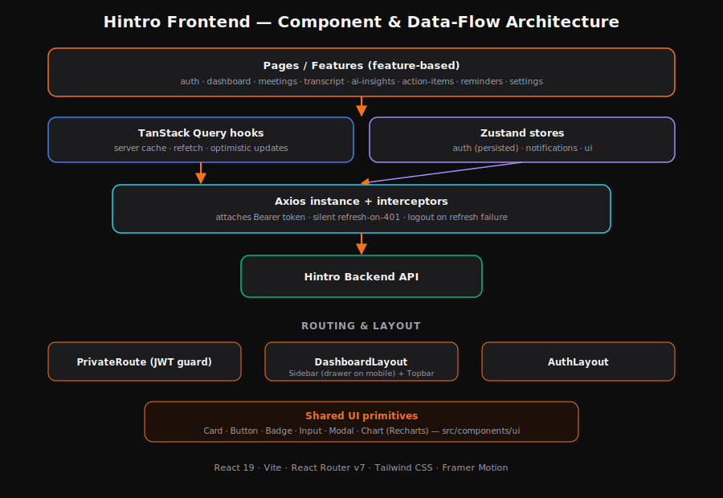
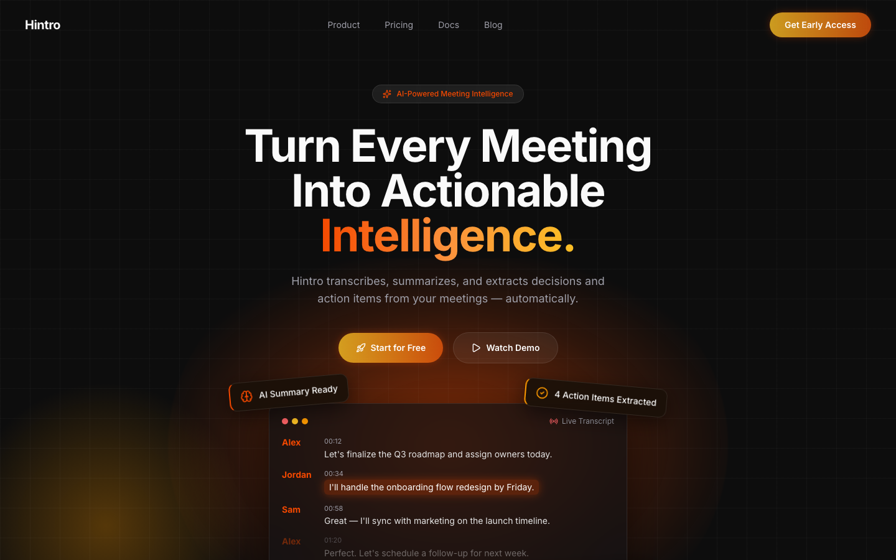
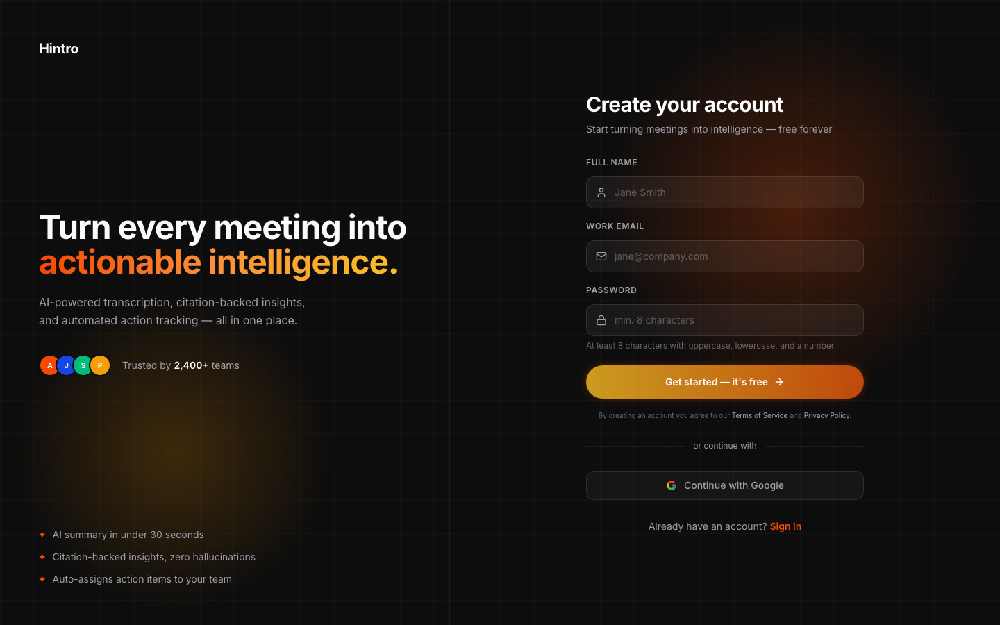
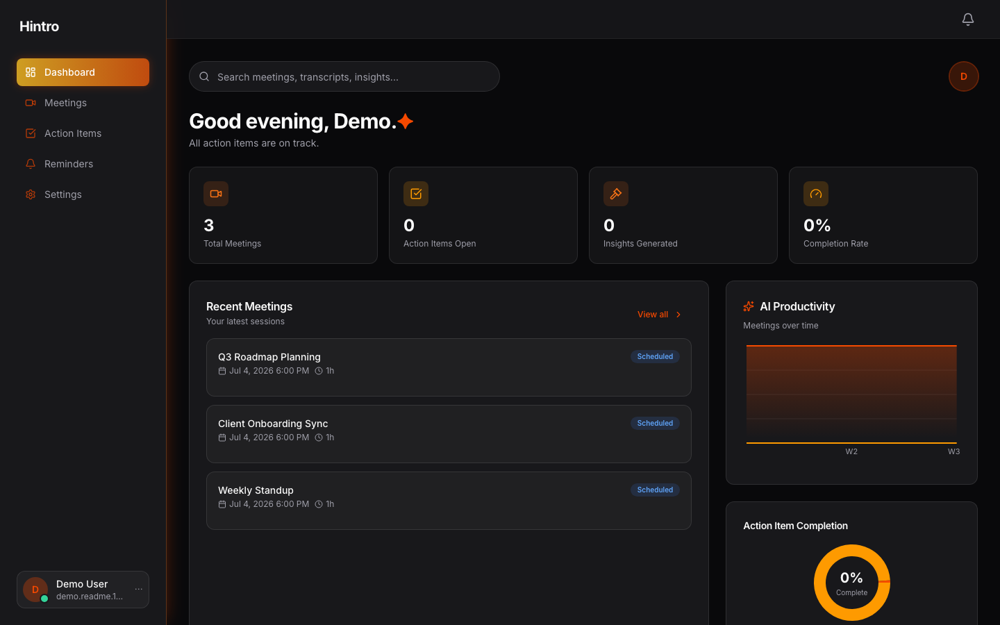
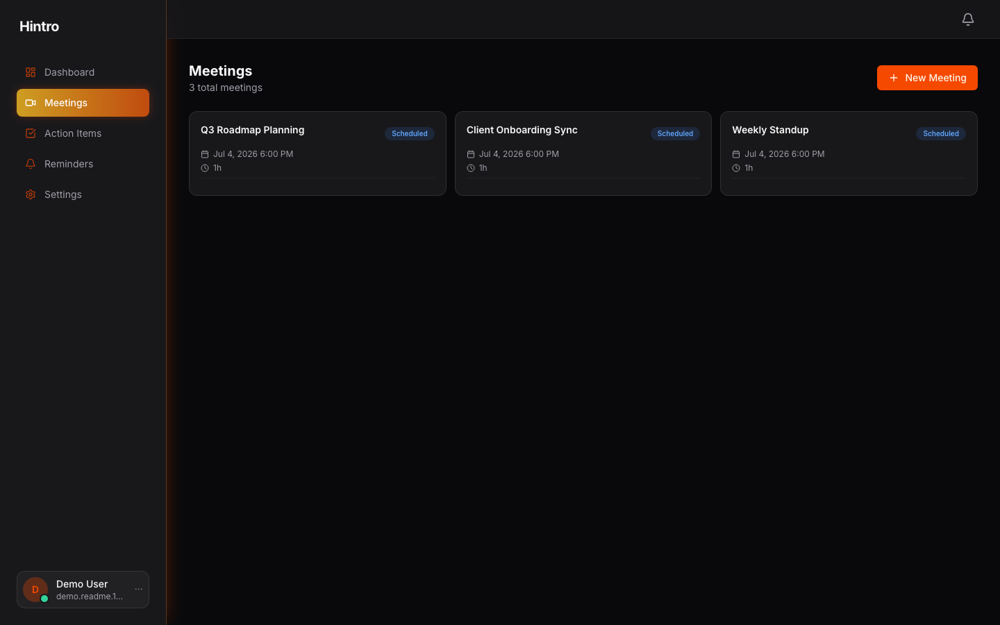
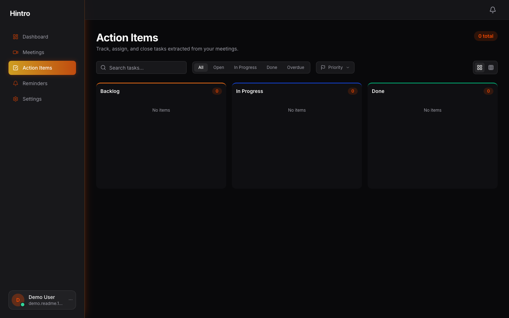
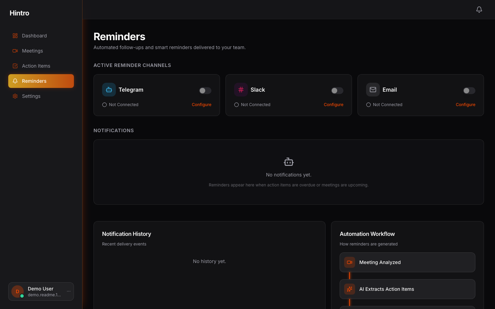

# Hintro Frontend

AI-powered Meeting Intelligence Platform — React 19 · Vite · Tailwind CSS.

The client for Hintro: schedule and run meetings, upload or record transcripts, generate citation-backed AI summaries/insights/action items, and manage reminders — with email/password or Google (via Auth0) sign-in.

**Live demo:** https://hintro-fronend-b2iz.vercel.app/

## Architecture (LLD)



Feature-based structure: each feature in `src/features/<feature>/` owns its pages, components, hooks, and services. Server state is cached with TanStack Query; client/UI state (auth session, notifications, sidebar) lives in Zustand. All API calls go through a single Axios instance whose interceptors attach the JWT and silently refresh it on a 401.

## Screenshots

<table>
  <tr>
    <td width="50%"></td>
    <td width="50%"></td>
  </tr>
  <tr>
    <td align="center"><sub>Landing page</sub></td>
    <td align="center"><sub>Register — email/password or Google</sub></td>
  </tr>
  <tr>
    <td width="50%"></td>
    <td width="50%"></td>
  </tr>
  <tr>
    <td align="center"><sub>Dashboard</sub></td>
    <td align="center"><sub>Meetings</sub></td>
  </tr>
  <tr>
    <td width="50%"></td>
    <td width="50%"></td>
  </tr>
  <tr>
    <td align="center"><sub>Action Items (kanban)</sub></td>
    <td align="center"><sub>Reminders</sub></td>
  </tr>
</table>

## Tech Stack

| Concern | Technology |
|---|---|
| Framework | React 19 + Vite |
| Routing | React Router v7 |
| Server state | TanStack Query v5 |
| Client state | Zustand v5 (persisted auth store) |
| Styling | Tailwind CSS |
| Animation | Framer Motion |
| Forms | React Hook Form |
| Charts | Recharts |
| HTTP | Axios (interceptor-based auth + silent refresh) |
| Video | ZegoCloud UIKit Prebuilt |
| Icons | lucide-react |
| Toasts | react-hot-toast |

## Quick Start

```bash
cp .env.example .env   # set VITE_API_BASE_URL to your backend
npm install
npm run dev            # starts on http://localhost:5173
```

## Environment Variables

| Variable | Required | Description |
|---|---|---|
| `VITE_API_BASE_URL` | Yes in production | Backend API base, e.g. `https://api.example.com/api/v1`. In dev, falls back to `/api/v1` proxied to `localhost:5001` by `vite.config.js`. |

## Scripts

```bash
npm run dev       # start dev server
npm run build     # production build (outputs to dist/)
npm run preview   # preview the production build locally
npm run lint      # eslint
npm run lint:fix  # eslint --fix
```

## Authentication

- **Email/password**: standard register/login against the backend, JWT access + refresh token pair stored in the Zustand `auth.store` (persisted to `localStorage`).
- **Google**: "Continue with Google" redirects to the backend's `/auth/google`, which brokers the OAuth2 flow through Auth0. On success the backend redirects back to `/oauth/callback` with the token pair in the query string; `OAuthCallbackPage` picks them up and hands off to the same auth store — from that point the app treats both login methods identically.
- `PrivateRoute` gates all authenticated routes on `isAuthenticated`; the Axios response interceptor transparently refreshes an expired access token and retries the original request, logging the user out only if the refresh itself fails.

## Project Structure

```
src/
├── api/                  # axios instance, interceptors, endpoint map
├── components/
│   ├── shared/            # EmptyState, ErrorBoundary
│   └── ui/                # Card, Button, Badge, Input, Modal, Chart, GoogleIcon...
├── features/
│   ├── auth/               # Login, Register, OAuth callback
│   ├── dashboard/
│   ├── meetings/            # list, detail, room (video), create modal
│   ├── transcript/
│   ├── ai-insights/
│   ├── action-items/
│   ├── reminders/
│   └── settings/
├── layouts/
│   ├── AuthLayout/          # branding panel + auth forms
│   └── DashboardLayout/     # Sidebar (mobile drawer) + Topbar + content
├── providers/               # AuthProvider, QueryProvider
├── routes/                  # AppRouter, PrivateRoute
├── store/                   # auth, notifications, ui (Zustand)
├── hooks/                   # useDebounce, useLocalStorage, useMediaQuery
└── utils/                   # cn, date/format utils
```

## Responsive Design

The dashboard shell collapses the sidebar into a slide-in drawer (with backdrop) below the `lg` breakpoint, with a hamburger toggle in the topbar. Data-heavy pages (meeting detail's transcript/analysis split, the action-items kanban/table, the meeting room's transcript panel) reflow to a single column or an overlay on small screens rather than clipping content.

## Deployment

Static build deployed to Vercel (`vercel.json` handles SPA routing — all paths rewrite to `index.html`). Required for a new environment:

1. `VITE_API_BASE_URL` set to the deployed backend's API base — Vite env vars are baked in at build time, so changing this requires a rebuild/redeploy, not just a config reload
2. The backend's `CLIENT_URL` (CORS + OAuth redirect target) must match this frontend's deployed origin exactly
